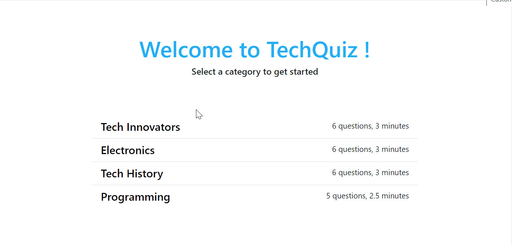

# TechQuiz
This is a simple Laravel quiz app, that allows users to test their knowledge in a variety of Technology topics. Users can select the quiz based on the desired topic, take the quiz and recieve a feedback.

It is precisely a multiple choice question quiz, where the user can select one or more options depending on the question. For scoring, unanswered questions and wrong answers (if at least one selected option is incorrect) score nothing.

## Usage
As the user selects a category in the home view, he gets directed to the quiz view which displays the first page of questions, and the timer starts counting down. 

The user can navigate between different questions by clicking on the desired page, and the state of the pages (the selected choices) is preserved. No page reload is done as the user navigates between pages. This grants a seamless user experience and allows the user to focus on a single question at a time.

If the user submits his answers, or if the countdown timer reaches 0, the answers are sent to the backend to compute the score and return the feedback view as a response. The feedback view displays the score of the user, the correct answers and the user answers for each question.

## Technologies Used
1. Laravel: MVC, Blade templates, Routing, Eloquent ORM, local scopes
2. MySQL
3. HTML, CSS, Bootstrap
4. Javascript: sessionStorage, fetch()

Eventhough this is a simple full-stack quiz app, it allowed me to learn new concepts such as preserving the answers of the user for each page using javascript sessionStorage and pagination. 

 
